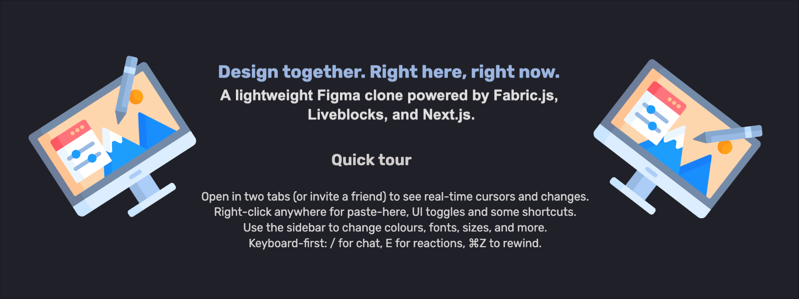
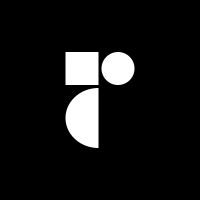

# CANVO - A simple figma clone with real-time collaboration

**[CANVO](https://figma-clone-iota-five.vercel.app/) – A simple figma clone with real-time collaboration using [Liveblocks](https://liveblocks.io/) and [Fabric.JS](https://fabricjs.com/)**



## 📋 <a name="table">Table of Contents</a>

1. ⭐️ [Overview](#overview)
2. ⚙️ [Tech Stack](#tech-stack)
3. 🔋 [Features](#features)
4. 🚀 [More Features to come](#more-features)
5. 🕸️ [Snippets](#snippets)
6. 🛤️ [Development Journey](#learning-journey)
7. 📝 [What I Learned](#what-i-learned)
8. 🙌 [Quick Start](#quick-start)
9. 👁 [Credits](#credits)

## <a name="overview">⭐️ Overview</a>

**_CANVO is a simple figma clone with real-time collaboration features, allowing multiple users to work on designs simultaneously._**

_It leverages [Liveblocks](https://liveblocks.io/) for real-time synchronization and [Fabric.JS](https://fabricjs.com/) for canvas rendering and manipulation. The app supports basic shapes (rectangle, circle, line), text, and image uploads. Users can select, move, resize, and delete objects on the canvas.
As well as edit their properties seamlessly_.
The main idea of the project was provided by [this tutorial](https://www.youtube.com/watch?v=oKIThIihv60&t=11666s) by [JavaScript Mastery](https://www.youtube.com/@JavaScriptMastery) and then I expanded it with more features and my own improvements.

## <a name="tech-stack">⚙️ Tech Stack</a>

<ul style="list-style-type:circle; font-size:16px; font-weight:600; line-height:2;">
<li style='display:flex; gap:12px; align-items:center;'>Next.js </li>
<li style='display:flex; gap:12px; align-items:center;'>TypeScript </li>
<li style='display:flex; gap:12px; align-items:center;'>Tailwind CSS </li>
<li style='display:flex; gap:12px; align-items:center;'>Radix UI </li>
<li style='display:flex; gap:12px; align-items:center;'>Liveblocks </li>
<li style='display:flex; gap:12px; align-items:center;'>Fabric.JS </li>
<li style='display:flex; gap:12px; align-items:center;'>Vercel </li>
</ul>

# <a name="features">🔋 Features</a>

⚡ **Real-Time Cursors, Chat, and Reactions**: Visualize every collaborator’s cursor, chat instantly, and exchange reactions for smooth teamwork.

🙋 **Active Users**: Displays all participants who are active, giving clear visibility into the session.

🔺 **Shape Builder**: Allows users to add a variety of shapes, expanding creative options within the workspace

🌆 **Image Integration**: Import pictures directly into the workspace, adding more creative possibilities.

🎨 **Customization**: Enables editing of design elements, including background colors, dimensions, rounded corners, font weight, and alignment.

🖌️ **Freeform Tool**: Enable expressive, hand-drawn elements for more dynamic design possibilities.

♻️ **Undo/Redo Controls**: Adjust your workflow with the ability to undo or redo actions at any time.

👉 **Keyboard Actions**: Allows users to utilize keyboard shortcuts for various actions, including copying, pasting, deleting, and triggering shortcuts for features like opening cursor chat, reactions, and more, enhancing efficiency and accessibility.

🎹 **Keyboard Actions**: Perform quick actions with shortcuts, from editing shapes to opening chat and reactions, streamlining the workflow.

👁️ **Hide/Show UI**: Temporarily remove panels or components from view for a distraction-free canvas.

📄 **Export as PDF**: Save the entire completed canvas design as a PDF for easy sharing or documentation.

🧹 **Quick Cleanup**: Clear the entire canvas with a single click when you want a fresh start.

# <a name="more-features">🚀 More Features to come</a>

<h3>There are many more features planned for future releases!</h3>

- **Collaborative Components**: Create and share reusable components with your team for consistent design.

- **Ability to lock objects**: Prevent accidental modifications by locking specific objects on the canvas.

- **Ability to bring objects forward/backward**: Manage the layering of objects on the canvas for better organization.

- **Ability to move around the canvas**: Navigate the canvas easily to focus on different areas of your design.

- **Ability to center objects on the canvas**: Quickly align objects to the center of the canvas for a balanced layout.

## <a name="snippets">🕸️ Snippets</a>

Here are some code snippets from the project:

<details>
<summary><code>useShortcut</code> Hook</summary>

```typescript
// hooks/useShortcut.ts
export function useShortcut({ bindings, options }: UseShortcutParams) {
  const enabled = options?.enabled ?? true;
  const preventDefault = options?.preventDefault ?? false;
  const bindingsRef = useRef<ShortcutMap>(bindings);
  bindingsRef.current = bindings;
  useEffect(() => {
    if (!enabled) return;
    const isEditableElement = (element: Element | null) => {
      if (!element || !(element instanceof HTMLElement)) return false;
      const tag = element.tagName;
      return tag === "INPUT" || tag === "TEXTAREA" || (element as HTMLElement).isContentEditable;
    };
    const onKeyDown = (e: KeyboardEvent) => {
      //Ignore if typing or holding
      if (isEditableElement(e.target as Element) || e.repeat) return;
      //Key is sensitive for all the components
      const handler = bindingsRef.current[e.key];
      if (handler) {
        if (preventDefault) e.preventDefault();
        handler(e);
      }
    };
    window.addEventListener("keydown", onKeyDown);
    return () => {
      window.removeEventListener("keydown", onKeyDown);
    };
  }, [enabled, preventDefault]);
}
```

</details>

<br/>

<details>
<summary><code>handlePaste</code> - ability to paste shapes from clipboard</summary>

```typescript
//lib/key-events.ts
export const handlePaste = async (
  canvas: Canvas,
  syncShapeInStorage: (object: FabricObject) => void
) => {
  const clipboard = localStorage.getItem("clipboard");
  if (!clipboard) return;
  const serialized = JSON.parse(clipboard);
  try {
    if (serialized.type !== "ActiveSelection") {
      const obj = await util.enlivenObjects<FabricObject>(serialized);
      if (!obj || obj.length === 0) return;
      for (const o of obj) {
        o.set({ left: (o.left ?? 0) + OFFSET, top: (o.top ?? 0) + OFFSET, objectId: uuidv4() });
        canvas.add(o as any);
        syncShapeInStorage(o as any);
        canvas.setActiveObject(o as any);
        canvas.requestRenderAll();
      }
    } else {
      //Due to the fact that once there are more active objects and their position stores relative to the active selection center we need to calculate the center of the active selection and then position each object relative to that center
      const activeSelectionCenterX = serialized.left + serialized.width / 2;
      const activeSelectionCenterY = serialized.top + serialized.height / 2;

      const objects = await util.enlivenObjects<FabricObject>(serialized.objects);
      for (const obj of objects) {
        const newLeft = activeSelectionCenterX + obj.left;
        const newTop = activeSelectionCenterY + obj.top;
        obj.set({ left: newLeft + OFFSET, top: newTop + OFFSET, objectId: uuidv4() });
        canvas.add(obj as any);
        syncShapeInStorage(obj as any);
        canvas.setActiveObject(obj as any);
        canvas.requestRenderAll();
      }
    }
  } catch (e) {
    console.error("Error parsing clipboard data:", e);
    return;
  }
};
```

</details>
<br/>
<details>
<summary><code>syncShapeInStorage</code> - update storage in the liveblocks to be able to display canvas modification live</summary>

```typescript
const syncShapeInStorage = useMutation(({ storage }, object) => {
  //Check if we have a valid object
  if (!object) return;
  // Get the objectId from the object - descructuring
  const { objectId } = object;
  //Turn the fabric object into a JSON format to be able to store it in the storage
  const dataShape = object.toJSON();
  dataShape.objectId = objectId;
  const canvasObjects = storage.get("canvasObjects");
  canvasObjects.set(objectId, dataShape);
}, []);
```

</details>
<br/>
<details>
<summary>
<code>normalizeHex</code> , <code>toHash</code> - utility functions to validate and normalize hex color input with how modifications are applied to the canvas objects (fillColor, strokeColor)
</summary>

```typescript
export const toHash = (s: string) => (s.startsWith("#") ? s : `#${s}`);
// Expand #RGB to #RRGGBB
const expand3 = (h: string) => {
  const s = h.replace("#", "");
  if (!HEX3.test(h)) return null;
  const [r, g, b] = s.split("");
  return `#${r}${r}${g}${g}${b}${b}`.toLowerCase();
};
// Return #RRGGBB or null if invalid
export const normalizeHex = (h: string): string | null => {
  // Accept #RGB or #RRGGBB (with or without #), return #RRGGBB
  const v = h.trim();
  if (HEX6.test(v)) return toHash(v).toLowerCase();
  const e3 = expand3(v);
  return e3 ?? null;
};
const commit = (raw: string) => {
  const norm = normalizeHex(raw);
  if (norm) {
    setTextHex(norm);
    setLastValidHex(norm);
    handleInputChange("fill", norm);
  } else {
    // revert visually to the last valid one
    setTextHex(lastValidHex);
    handleInputChange("fill", lastValidHex);
  }
};
```

</details>

## <a name="learning-journey">🛤️ Development Journey</a>

The main idea of the project was provided by [this tutorial](https://www.youtube.com/watch?v=oKIThIihv60&t=11666s) by [JavaScript Mastery](https://www.youtube.com/@JavaScriptMastery) From there, I expanded it with my own features, improvements, and refactors.

The tutorial gave me a strong foundation and inspiration, but I decided not to follow the codebase directly. Instead, I treated it as a _launching pad_ for building my own version, making architectural and design choices along the way. Some of the main differences and learning points include:

- 🔧 **Fabric.js Updates:** The tutorial used an older version of Fabric.js, which introduced limitations and bugs. I restructured large parts of the codebase to work with the latest Fabric.js version.

- ✨ **Feature Enhancements:** Some implementations felt too simplistic, so I redesigned them to be more scalable and reusable.

- ➕ **Additional Features:** I added functionality beyond what the tutorial covered (Hide/Show UI/Layers, More Shortcuts, Pasting multiple elements('activeSelection)).

- 🎨 **Custom UI Design:** Instead of following the default UI, I created my own layouts and styling as a way to practice and push my **Tailwind CSS** skills further.

- 🧩 **UI Library Choice:** I replaced ShadCN UI with **Radix UI**, which gave me more flexibility, lower abstraction, and more opportunities to write custom code — something I personally enjoy.

## <a name="what-i-learned">📝 What I Learned</a>

This project wasn’t just about reproducing features — it was about exploring **collaborative design tools** from the ground up. Key takeaways for me were:

- Working with **real-time collaboration** through Liveblocks
- Deepening my understanding of **canvas rendering** with Fabric.js — learning its quirks, capabilities, and how to effectively navigate its documentation
- Practicing how to **analyze and adapt someone else’s codebase**, deciding what to keep, rework, or discard, and how to build on top of it
- Structuring **scalable state management** for complex UI interactions
- Balancing **tutorial-driven learning** with **independent problem-solving**
- Applying **mathematical thinking and problem-solving skills** to reason about functionality and design robust solutions

## <a name="quick-start">🙌 Quick Start</a>

To get started with the project, follow these steps:

1. Clone the repository:

   ```bash
   git clone https://github.com/SidorovaMaria/figma-clone.git
   cd figma-clone
   ```

2. Install the dependencies:

   ```bash
   npm install
   ```

3. Set up environment variables:

   Create a `.env.local` file in the root directory and add your Liveblocks public key:

   ```env
   NEXT_PUBLIC_LIVEBLOCKS_PUBLIC_KEY=your_liveblocks_public_key
   ```

4. Start the development server:

   ```bash
   npm run dev
   ```

5. Open your browser and navigate to `http://localhost:3000` to see the app in action.

## <a name="credits">👁 Credits</a>

- [JavaScript Mastery](https://www.youtube.com/@JavaScriptMastery) for the foundational tutorial that inspired this project.
- [Liveblocks](https://liveblocks.io/) for providing the real-time collaboration infrastructure.
- [Fabric.JS](https://fabricjs.com/) for the powerful canvas rendering and manipulation library.
- [Radix UI](https://www.radix-ui.com/) for the accessible and customizable UI components.
- <a href="https://www.flaticon.com/free-icons/graphic-design" title="graphic design icons">Graphic design icons created by Freepik - Flaticon</a> - for the Logo used in the project.
